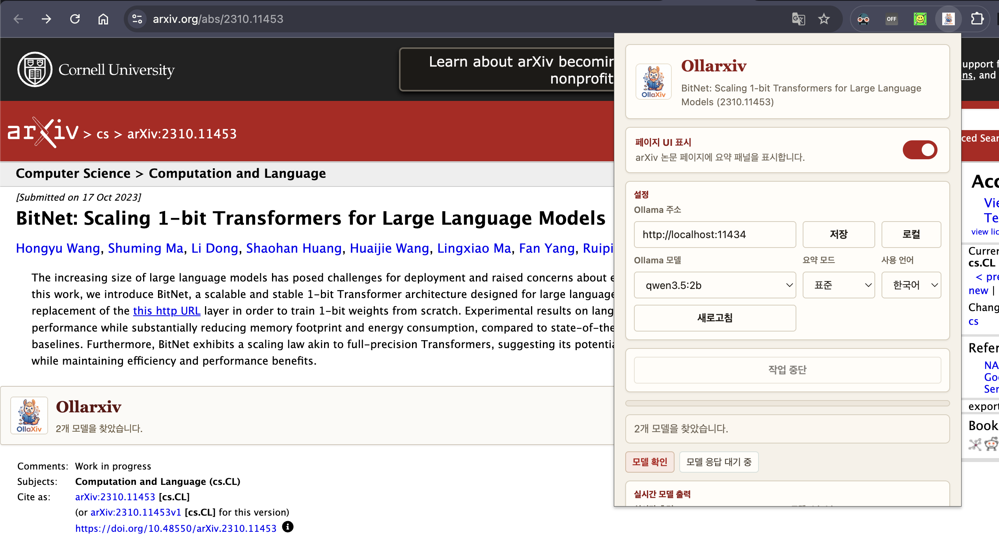
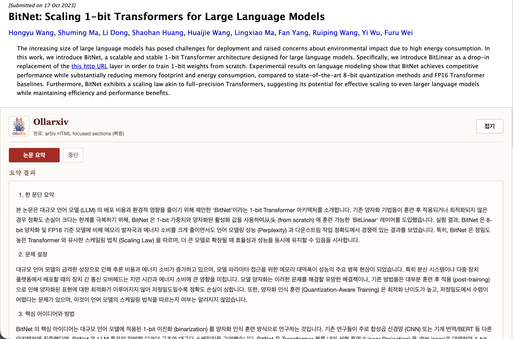

# OllaXiv

**Language:** [한국어](README.md) | English

<p align="center">
  
</p>

OllaXiv is a Chrome extension for reading arXiv papers with Ollama. It summarizes the paper you are viewing, lets you ask follow-up questions about the paper, and keeps the workflow local-first by default.

It is built for people who want to understand papers faster without sending paper text to a hosted LLM service. You can use a local Ollama server on your machine, or point the extension to a remote Ollama-compatible endpoint that you control.

## What It Does

- Summarizes the current arXiv paper directly inside the arXiv page.
- Lets you continue asking questions based on the generated summary and paper text.
- Shows evidence snippets such as `[S1]`, so you can inspect where an answer came from.
- Supports Korean and English UI/output.
- Supports local or remote Ollama URLs.
- Stores settings, logs, source text cache, and summary cache in Chrome local storage.
- Shows progress logs for model loading, text extraction, summarization, and paper Q&A.

## Assets

The official mascot, logo, and icon files are included in `assets/`.

- Large logo: `assets/OllaXiv.png`
- Large square logo: `assets/OllaXiv-square.png`
- Chrome icons: `assets/icon-16.png`, `assets/icon-32.png`, `assets/icon-48.png`, `assets/icon-128.png`
- Usage screenshots: `assets/ollaxiv_use1.png`, `assets/ollaxiv_use2.png`

<p align="center">
  
</p>

## Install

### Option 1. Chrome Web Store

Install OllaXiv from the Chrome Web Store:

[Chrome Web Store - OllaXiv (not yet)](https://chromewebstore.google.com/detail/hjaaenpglimkmieebbbhlaiaolfdpgle?utm_source=item-share-cb)

### Option 2. Install From This Repository

1. Download this repository.

```bash
git clone https://github.com/z8086486/OllaXiv.git
cd OllaXiv
```

2. Open Chrome and go to:

```text
chrome://extensions
```

3. Turn on `Developer mode`.
4. Click `Load unpacked`.
5. Select the downloaded `OllaXiv` folder.

After loading, the OllaXiv icon should appear in Chrome's extension toolbar.

## Required Ollama Setup

OllaXiv talks to Ollama from a Chrome extension origin. Depending on how Ollama is running, Ollama may reject extension requests with HTTP 403 unless `OLLAMA_ORIGINS` is configured.

On macOS, if you run Ollama through the Ollama app, run:

```bash
launchctl setenv OLLAMA_ORIGINS "chrome-extension://*"
```

Then fully quit and restart Ollama.

If you run Ollama directly from Terminal, stop the existing Ollama process and start it with:

```bash
OLLAMA_ORIGINS="chrome-extension://*" ollama serve
```

You also need at least one Ollama model installed:

```bash
ollama pull qwen3.5:4b
```

You can use another model if it is available in your Ollama installation.

## Usage

1. Open an arXiv paper page, for example:

```text
https://arxiv.org/abs/2401.00000
```

2. Open the OllaXiv popup and check:

   - Ollama URL
   - model
   - summary mode
   - language
   - whether the page UI is enabled
3. On the arXiv page, expand the OllaXiv panel.
4. Click `Summarize paper`.
5. Read the generated summary inside the page.
6. Ask follow-up questions in the paper chat box.

The popup is mainly for settings, status, progress logs, and local storage management. The arXiv page panel is where summaries and paper Q&A are shown.

### Popup Settings And Page Panel

The popup controls the extension state: page UI on/off, Ollama URL, model, summary mode, language, progress logs, and local storage.

<p align="center">
  
</p>

When page UI is enabled, OllaXiv appears inside the current arXiv paper page. The page panel starts compact, then expands into the summary and paper Q&A workspace.

### Summary On The arXiv Page

After summarization, the result is rendered directly below the paper abstract. The extension keeps the arXiv-like layout, while adding the OllaXiv summary and chat area.

<p align="center">
  
</p>

## Summary Modes

- `Fast`: Uses a focused input from the abstract, opening, introduction, and conclusion-like sections. This is the quickest mode.
- `Standard`: Uses chunked summarization without thinking mode. This is the default balance.
- `Detailed`: Uses smaller chunks and enables Ollama thinking when supported by the model. This is slower but more thorough.

## How Paper Text Is Collected

OllaXiv tries sources in this order:

1. arXiv HTML
2. ar5iv HTML
3. arXiv e-print source and TeX extraction
4. arXiv PDF text extraction
5. arXiv abstract and metadata fallback

Long papers may be truncated according to the selected summary mode.

## Local Storage

OllaXiv stores data in Chrome local storage:

- `selectedModel`
- `selectedMode`
- `selectedLanguage`
- `ollamaBase`
- `pagePanelEnabled`
- `processLog:*`
- `sourceCache:*`
- `summaryCache:*`

You can inspect and delete these items from the popup's local storage section.

## Remote Ollama URL

The default Ollama URL is:

```text
http://localhost:11434
```

You can change it in the popup if you run Ollama on another host. Use `Reset to local` to restore the default URL.

## Troubleshooting

### Ollama HTTP 403

Run the `OLLAMA_ORIGINS` setup described above, then restart Ollama and reload the extension from `chrome://extensions`.

### No Models Found

Check that Ollama is running:

```bash
ollama list
```

If the list is empty, install a model:

```bash
ollama pull qwen3.5:4b
```

### Page Panel Does Not Appear

Open the popup and make sure `Show page UI` is enabled. Then reload the arXiv tab.

## License

MIT
